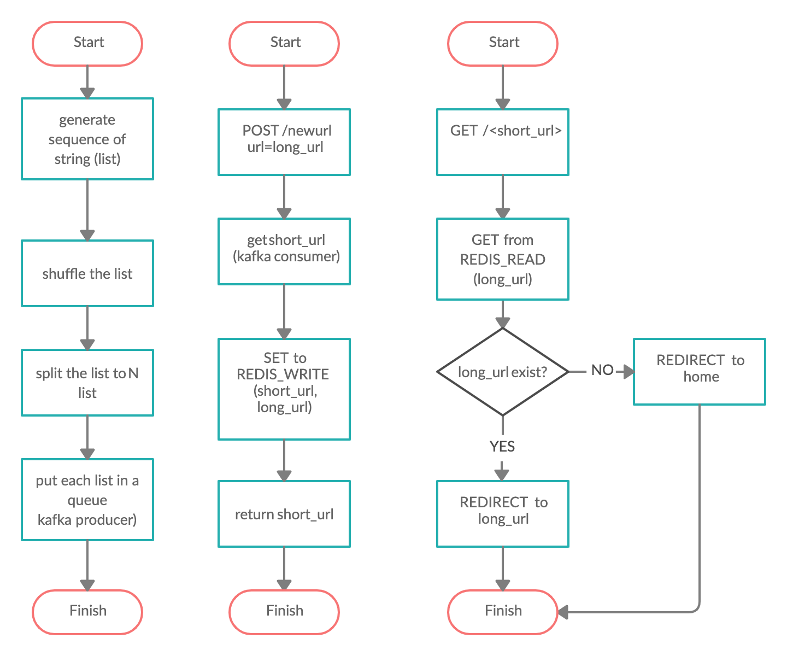

# Q3. System Design and Implementation
A URL shortening Flask micro website similar to bit.ly. The `/newurl` endpoint will receive long url as input, and store it to redis as key value pair. In this case, key is short string that generated beforehand and value is long url from the input. When `/{short string}` endpoint is accessed, it will redirect to long url

# Requirement
- Docker (v19.03.12)
- Docker compose (v1.21.2)

# Build & Deployment
Please execute `build-deploy.sh` to build Flask app as docker image, then run it as docker container as defined in `docker-compose.yml`. Docker Compose also will help to spin up required service, such as redis. You may need to adjust `FLASK_APP_HOST` env to fit your host/domain configuration.

In real world usage, we can rewrite `build-deploy.sh` to CI tools config file, such as Jenkinsfile, gitlab-ci.yml, travis.yml, etc. We can set a hook, so every commit we push to the repo will trigger build, and store the docker images (artifact) to artifactory such as Docker hub or AWS ECR.

For Docker Compose approach, we can write Helm Chart and use Helm to deploy the app to Kubernetes. We also can use Terraform to launch infrastructure that required by the app, such as AWS ElastiCache Redis, Aurora MySQL, etc.

# System Design
To address system​ design​ concern such as high availability, scalability and reliability, we can split the service to smaller serice (microservice). For url shortening service, we can split it into short string generator service, api/web serice to serving the actual request and and service to ensure data durability.

## Infrastructure​ Configuration

## generator

## app

## durable

## Flow Chart

# Limitation
- Please​ state​ any​ assumption​ and​ limitation​ of​ ​the system​ implemented.
