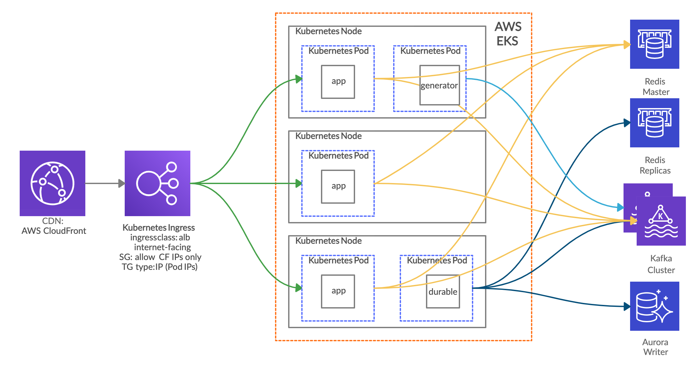
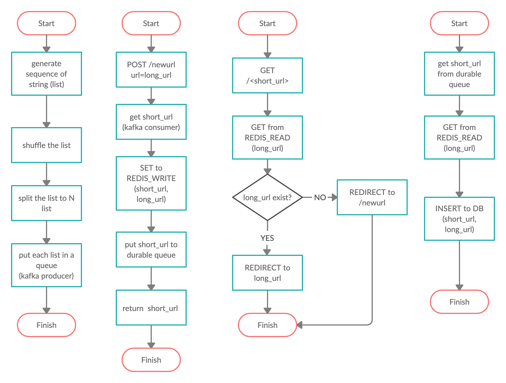

# Q3. System Design and Implementation
A URL shortening Flask micro website similar to bit.ly. The `/newurl` endpoint will receive long url as input, and store it to redis as key value pair. In this case, key is short string that generated beforehand and value is long url from the input. When `/<short_url>` endpoint is accessed, it will redirect to long url

# Requirement
- Docker (v19.03.12)
- Docker compose (v1.21.2)

# Build & Deployment
Please execute `build-deploy.sh` to build Flask app as docker image, then run it as docker container as defined in `docker-compose.yml`. Docker Compose also will help to spin up required service, such as redis. You may need to adjust `FLASK_APP_HOST` env to fit your host/domain configuration.

In real world usage, we can rewrite `build-deploy.sh` to CI tools config file, such as Jenkinsfile, gitlab-ci.yml, travis.yml, etc. We can set a hook, so every commit we push to the repo will trigger build, and store the docker images (artifact) to artifactory such as Docker hub or AWS ECR.

For Docker Compose approach, we can write Helm Chart and use Helm to deploy the app to Kubernetes. We also can use Terraform to launch infrastructure that required by the app, such as AWS ElastiCache Redis, Aurora MySQL, etc.

# System Design
To address system​ design​ concern such as high availability, scalability and reliability, we can split the service to smaller serice (microservice). For url shortening service, we can split it into short string generator service, api/web serice to serving the actual request and and service to ensure data durability.

## Infrastructure​ Configuration

## *generator*
This program will be responsible to generate short string that will be used in short url. The *generator* will generate a list of sequential string, shuffle the list to rearrange its sequence, split the list to N number of list (smaller list), and put each list to a queue. Basically, *generator* is queue producer/publisher. We can use Kafka for this approach.

In our case, it will have maximum (26+26+10)^9 number of string. The *generator* may only generate small sequence first, then later generate next sequence when the queue started to consumed by the app. The reason why we generate the string beforehand is to ensure short url never get duplicated.

## *app*
This program will be responsible to serving user request. The *app* will receive long url as input within `/newurl` endpoint, consume from random queue in Kafka to get short string, set to Redis with short string as key & long url as value, then return short url to the user with 201 http code. Basically, *app* is queue consumer/subscriber.

After the *app* successfully return short url to user, it will put same short string to another queue to be consumed by
*durable* program.

When the user accessing `/<short_url>`, the *app* will get long url (value) using short string (key) from read-only Redis. If value is exist, *app* will redirect user to long url with 304 http code. Otherwise, will redirected to `/newurl`

## *durable*
This program will be responsible to backup short string and long url data pair to another database that more durable and designed as long term storage. We can use MySQL for this approach. The *durable* will consume from *durable* queue to get short string that already consumed by *app*, then it will get the value (long url) from read-only Redis, and finally write the data (short string and long url pair) to MySQL master.

With this approach, later we can always restore the data from MySQL to Redis - in case we partially/completely loss the data in Redis.

## Flow Chart

## Implementation Assumption​
- Required infrastructure to run this application hosted across multiple AZs
- Using cloud provider managed service (i.e ALB, ElastiCache, Aurora), since they already provide HA Design, easier to scale and having SLA for availability/reliability.

## Implementation Limitation
- The *generator* and *durable* not implemented in the code within this repo. Short string is generated randomly from the *app*, and having mechanism to avoid its duplication. The *app* will check only if short string does not have any value from read-only Redis, then it will write short string & long url data pair to writeable Redis.
